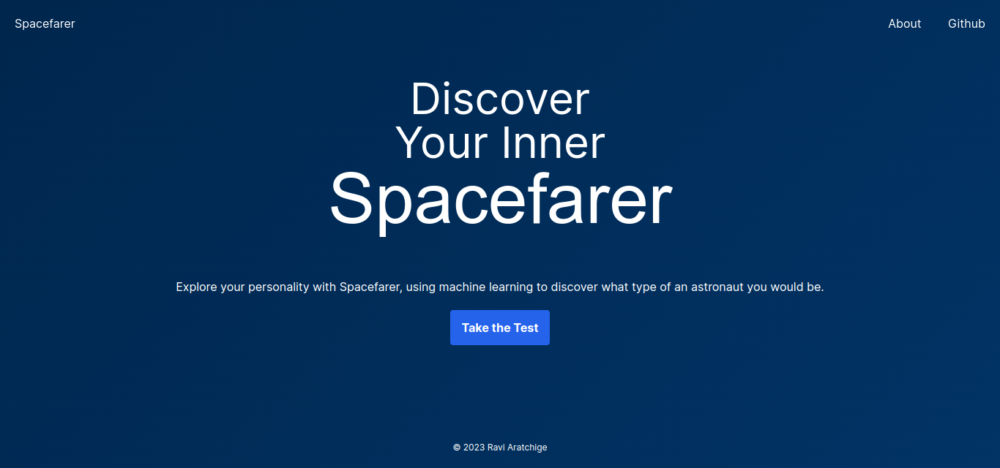
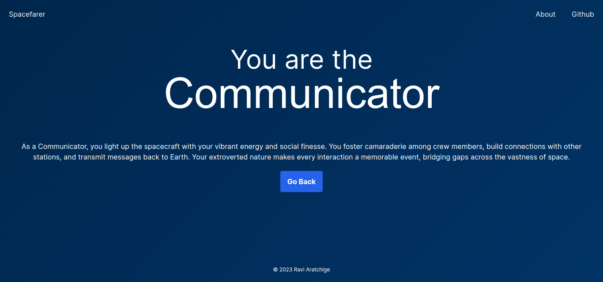

# Spacefarer


Ever wondered what role you would play if you were a cosmic voyager, adventuring through space with your resourceful crew members?

Spacefarer uses machine learning to determine what type of astronaut you would be, based on your responses to a series of questions about your personality.



You can be one of the following types of astronauts:

1. **Navigator** - steers and guides the spacecraft in the vast depths of space.
2. **Communicator** - maintains contact with stations and other spacecrafts.
3. **Explorer** - ventures boldly into uncharted realms and territories.
4. **Commander** - leading the spacecraft, its crew and their operation.
5. **Scientist** - conducting research and unraveling the mysteries of the cosmos.

Spacefarer asks you a series of 20 space-themed questions; 4 questions each for the 5 personality traits of the **Big Five Personality Test**:

1. Openness
2. Neuroticism
3. Conscientiousness
4. Agreeableness
5. Extraversion

The answers provided to these questions are passed to a trained and deserialized model, which predicts your personality type, which is in turn mapped to a type of astronaut.



Spacefarer is built as a Flask web app powered by a `LogisticRegression` model trained on a small (approx. 700 samples) dataset from <a href="https://www.kaggle.com/datasets/pavlorymarchuk/test3434?select=test.csv">Kaggle</a>. The model has an accuracy of **81.53%**.

## Setup

### Prerequisites

You must have Python installed on your system (preferably added to the `PATH`). It is recommended to have a version greater than 3.9.0 installed.

To run Spacefarer locally on your machine, follow these steps:

### 1. Clone Project

Clone Spacefarer to a desired location (folder) on your machine:

```shell
git clone https://github.com/ravi-aratchige/spacefarer.git
```

### 2. Activate Virtual Environment

A virtual environment will help you keep Spacefarer's dependencies isolated from the global system of Python packages. To setup your virtual environment, first ensure that `virtualenv` is installed on your system:

```shell
pip install virtualenv
```

To create and activate a virtual environment, open up a terminal from the cloned `spacefarer` folder and enter the following commands:

```shell
# Create a virtual environment named 'env':
python -m venv env

# Activate the virtual environment (Windows):
env\Scripts\activate.bat

# Activate the virtual environment (MacOS / Linux):
source env/bin/activate
```

Your terminal will now include an `(env)` prefix, indicating a successful activation of the virtual environment:

```shell
# On Windows:
(env) drive:\folder\...spacefarer>

# On MacOS and Linux
(env) user@computer:~/...spacefarer$
```

To deactivate the virtual environment (and remove the `(env)` prefix):

```shell
deactivate
```

### 3. Install Dependencies

After activating the virtual environment, you can install all of the necessary dependencies with a single command:

```shell
pip install -r requirements.txt
```

<a href="https://github.com/ravi-aratchige/spacefarer/blob/main/requirements.txt">`requirements.txt`</a> includes all of the project's dependencies and their respective versions.

### 4. Start Flask App

Move from the root of the project into the `app` directory (where the Flask app is stored in):

```shell
cd app
```

Then, install the necessary NPM packages. This is essential for TailwindCSS:

```shell
npm install

# or

npm i
```

Finally, start up the Flask server:

```shell
python app.py

# or

python3 app.py
```

Flask will then serve Spacefarer on <a>http://localhost:5000</a> (development server).

## Contribution

This project is fully open-source (including data and the model). Contributions are always welcome; you may fork this project, work on it and submit a pull request.

**IMPORTANT**: during development, the TailwindCSS build process must be started (for automatic purging and optimization).

For this, first enter the `app` folder in the project directory (after activating the virtual environment):

```shell
cd app
```

Then, run the following command:

```shell
npm run create-css
```

This project is still underway, so you can expect changes often!

---

© 2023 Ravindu Aratchige. Licensed under the <a href="https://github.com/ravi-aratchige/spacefarer/blob/main/LICENSE">Apache License<a>.